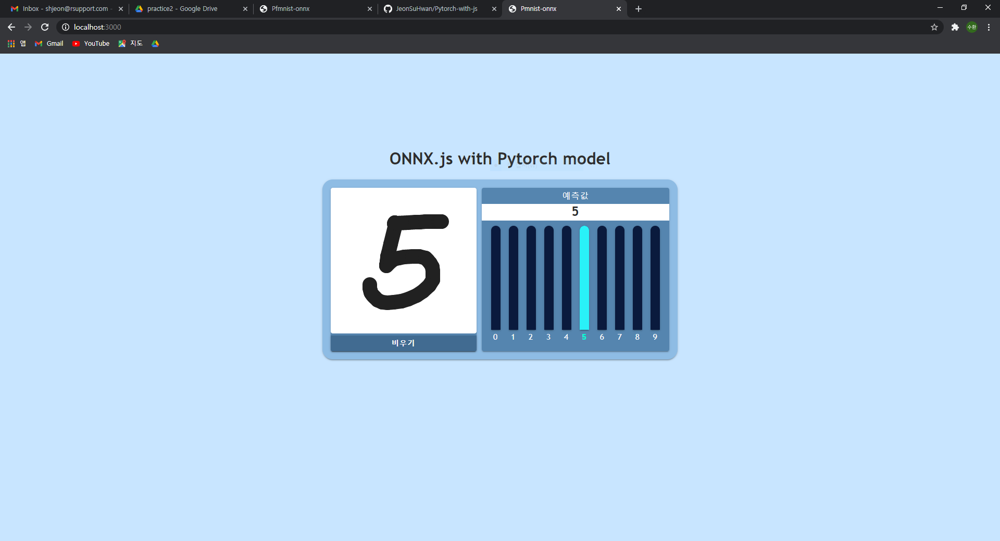
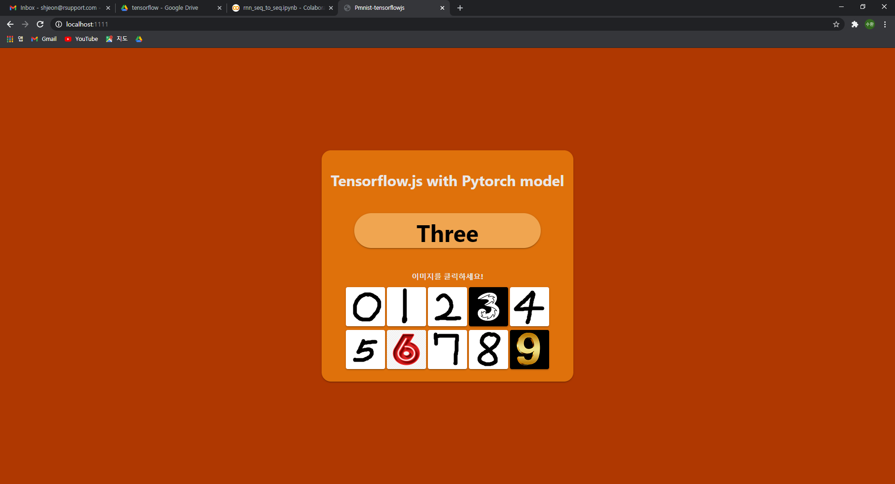
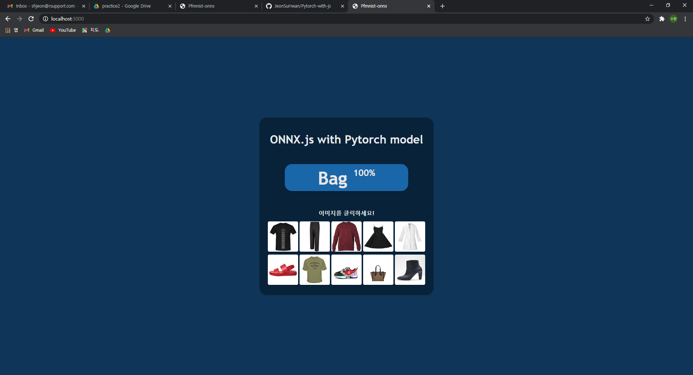
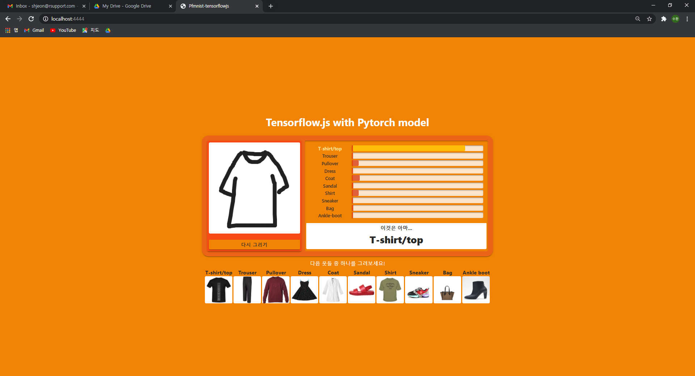

# Pytorch-with-js
pytorch 모을 각 프레임워크에 적용

<h3>Result (Mnist model - onnx.js)</h3>

<h3>Result (Mnist model - tensorflow.js)</h3>

<h3>Result (Fashion mnist model - onnx.js)</h3>

<h3>Result (Fashion mnist model - tensorflow.js)</h3>

